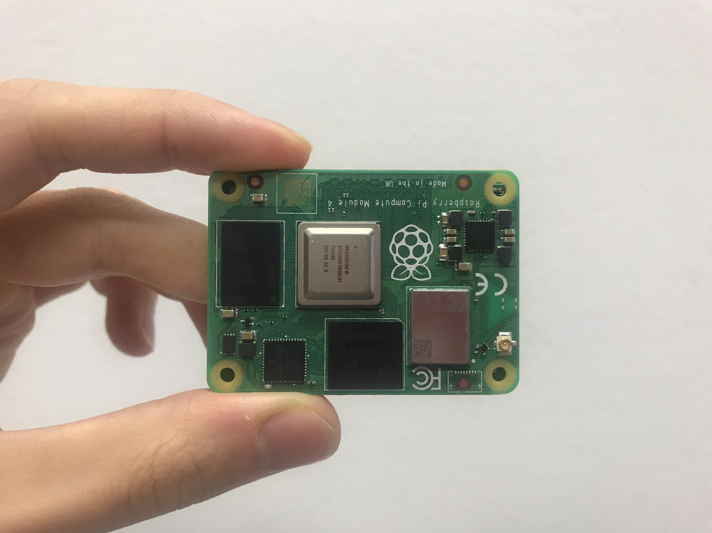
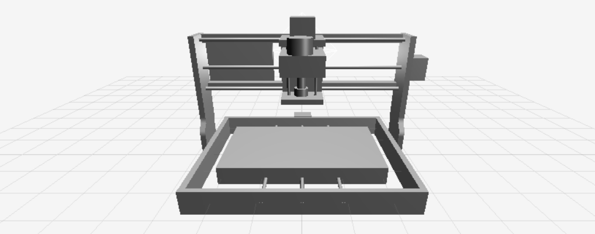

# **ECSK:** **E**deg **C**omputing **S**ensor **K**it
**Editor:** Bohao Chu, **Date:** 09.09.2022, **Email:** bohao.chu@qq.com

**Supervisor:**  Fuyin Wei, Fei Xiang, Bernd Noche

## **BASIC**
`git clone --recurse-submodules https://github.com/dexhoui/Edge-Computing-Sensor-Kit.git ./`
> git clone --recurese-submodules = git submodule init && git submodule update

`git submodule update --remote` update submodule from branch.

## **INTRODUCTION**

In traditional IoT scenarios, **Specific-Purpose Sensor (SPS)** or **Distributed Multi-Sensor (DMS)** are usually deployed directly on different locations or objects to sense diverse purposes, However, the number of sensing purposes always conflict with the complexity of networking and deployment. **Integrated Multi-Sensor Tag (IMST)** alleviates this problem, such as Texas Instruments <i>SimpleLink SensorTag</i> and Laput's <i>Synthetic Sensors</i>, with multiple sensors integrated on a small board to indirectly monitor a large context,  without direct instrumentation of objects. But due to the limited computing power of IMST, a large amount of raw data still needs to be sent to the remote server for processing through wireless technologies such as <i>Bluetooth</i> or <i>WiFi</i> , which may lead to processing delays, data leakage or intrusion.

In this work, we explore the concept of **Edge Computing Senosr Kit (ECSK)** based on the former work. We designed a new type of hardware that integrates several different types of sensors, including a camera and a microphone, on a small board, while adding a powerful processor and tpu, which allows algorithmic models and applications to run directly on the it instead of on a remote server. Each sensor has a task channel of its own, and multiple sensors can independently perform data sampling and feature extraction with concurrency. Feature data from different sensor channels are used to achieve real-time recognition of general activities in the environment (e.g., robotic arm movement) by a **Machine Learning (ML)** based multi-sensor **Information Fusion** algorithm. 

## **HARDWARE**
We designed a new type of hardware that integrates several different types of sensors, including a camera and a microphone, on a small board, while adding a powerful processor and tpu, which allows algorithmic models and applications to run directly on the it instead of on a remote server.

Enter our <a href="./hardware/">Hardware Folder</a> to konw how to use it

<table border="1" style="text-align: center;">
    <tr>
        <td><b>Module</b></td>
        <td><b>Model</b></td> 
        <td><b>Protocol</b></td>
        <td><b>Frequency</b></td> 
        <td><b>Channel</b></td>
        <td><b>Description</b></td>
    </tr>
    <tr>
        <td><a href="https://coral.ai/products/accelerator-module">Coral</a></td>
        <td>G313</td> 
        <td>USB3.0</td> 
        <td>4TOPS</td>
        <td>1</td>
        <td>The Accelerator Module is a surface-mounted module that includes the Edge TPU and its own power control. It provides accelerated inferencing for TensorFlow Lite models on your custom PCB hardware.</td>
    </tr>
    <tr>
        <td>CM4</td>
        <td>ARM</td> 
        <td>/</td> 
        <td>Foo</td>
        <td>Foo</td>
        <td>/</td>
    </tr>
    <tr>
        <td>Microphone</td>
        <td><a href="https://learn.adafruit.com/adafruit-i2s-mems-microphone-breakout/raspberry-pi-wiring-test">INMP441</a></td> 
        <td>I2S</td> 
        <td>15K</td>
        <td>1</td>
        <td>1</td>
    </tr>
    <tr>
        <td>Motion Processing Unit</td>
        <td><a href="https://invensense.tdk.com/products/motion-tracking/9-axis/mpu-9250/">MPU9250</a></td> 
        <td>I2C</td> 
        <td>1K</td>
        <td>3</td>
        <td>The MPU-9250 is the company’s second generation 9-axis Motion Processing Unit™ for smartphones, tablets, wearable sensors, and other consumer markets.</td>
    </tr>
    <tr>
        <td>Laser</td>
        <td><a href="https://www.sparkfun.com/products/14722">VL53L1X</a></td> 
        <td>I2C</td> 
        <td>20</td>
        <td>1</td>
        <td>The MPU-9250 is the company’s second generation 9-axis Motion Processing Unit™ for smartphones, tablets, wearable sensors, and other consumer markets.</td>
    </tr>
    <tr>
        <td>EYE</td>
        <td><a href="https://www.sparkfun.com/products/14607">AMG8833</a></td> 
        <td>I2C</td> 
        <td>20</td>
        <td>1</td>
        <td>The MPU-9250 is the company’s second generation 9-axis Motion Processing Unit™ for smartphones, tablets, wearable sensors, and other consumer markets.</td>
    </tr>
    <tr>
        <td>BME</td>
        <td><a href="https://www.raspberrypi-spy.co.uk/2016/07/using-bme280-i2c-temperature-pressure-sensor-in-python/">BME280</a></td> 
        <td>I2C</td> 
        <td>20</td>
        <td>1</td>
        <td>The MPU-9250 is the company’s second generation 9-axis Motion Processing Unit™ for smartphones, tablets, wearable sensors, and other consumer markets.</td>
    </tr>
    <tr>
        <td>Color</td>
        <td><a href="https://www.sparkfun.com/products/12829">ISL29125</a></td> 
        <td>I2C</td> 
        <td>20</td>
        <td>1</td>
        <td>The MPU-9250 is the company’s second generation 9-axis Motion Processing Unit™ for smartphones, tablets, wearable sensors, and other consumer markets.</td>
    </tr>
    <tr>
        <td>ADC</td>
        <td><a href="https://www.sparkfun.com/products/15334">ADS1015</a></td> 
        <td>ADC</td> 
        <td>3.3K</td>
        <td>1</td>
        <td>The MPU-9250 is the company’s second generation 9-axis Motion Processing Unit™ for smartphones, tablets, wearable sensors, and other consumer markets.</td>
    </tr>
    <tr>
        <td>PIR</td>
        <td><a href="https://eu.mouser.com/ProductDetail/Panasonic-Industrial-Devices/AMN21111?qs=mTeSeKeuVA47b9orPGfrSw%3D%3D">AMN2111J</a></td> 
        <td>ADC</td> 
        <td>3.3K</td>
        <td>1</td>
        <td>The MPU-9250 is the company’s second generation 9-axis Motion Processing Unit™ for smartphones, tablets, wearable sensors, and other consumer markets.</td>
    </tr>
    <tr>
        <td>EMI</td>
        <td><a href="https://www.mouser.de/ProductDetail/Bourns/RLB0913-104K?qs=Rodu%2FvDoGwLymOumQmWR1A%3D%3D&mgh=1&vip=1&gclid=CjwKCAjwvsqZBhAlEiwAqAHElV2dEPjAkC9ngPHqMGE1YfzbLPp8Bsx_6S_zXgeyLb4fCHtJOefOBRoCmfkQAvD_BwE">100MH</a></td> 
        <td>ADC</td> 
        <td>3.3K</td>
        <td>1</td>
        <td>The MPU-9250 is the company’s second generation 9-axis Motion Processing Unit™ for smartphones, tablets, wearable sensors, and other consumer markets.</td>
    </tr>
    <tr>
        <td>Camera</td>
        <td><a href="https://www.raspberrypi.com/products/camera-module-v2/">IMX219</a></td> 
        <td>CSI</td> 
        <td>80</td>
        <td>1</td>
        <td>The MPU-9250 is the company’s second generation 9-axis Motion Processing Unit™ for smartphones, tablets, wearable sensors, and other consumer markets.</td>
    </tr>
</table>

## **SOFTWARE**

## **SENSOR EDGE**

## **SENSOR SERVER**

## **SENSOR APP**
