# **SENSOR EDGE**
**Editor:** Bohao Chu, **Date:** 20.09.2022, **Email:** bohao.chu@qq.com

**Supervisor:**  Fuyin Wei, Fei Xiang, Bernd Noche

We need to do some initialization before runing our embedded program and machine learning model.

## **BASIC ENVIRONMENT**
We recommend to install the following softwares before starting this section.

[Advance IP Scanner](https://download.radmin.com/download/files/Radmin_3.5.2.1_EN.zip) for getting the IP of ECSK.

[PUTTY](https://the.earth.li/~sgtatham/putty/latest/w64/putty-64bit-0.77-installer.msi) for connecting the ECSK via SSH. 

We recommend that the following two commands before executing any installation to ensure proper installation of the latest software.

- `sudo apt update`

- `sudo apt upgrade`

Install some common software. Some software requires your confirmation, so type Y when prompted.

- `sudo apt install git vim i2c-tools python3-pip portaudio19-dev libsndfile1`

Download source code.

- `git clone --branch edge https://github.com/dexhoui/Edge-Computing-Sensor-Kit.git ~/edge`

Install some python libraries.
- `sudo pip3 install smbus sparkfun-qwiic serial pyaudio matplotlib librosa tflite-runtime adafruit-python-shell`

### **A. Sensors Driver**
<table border="1" style="text-align: center;">
    <tr>
        <td><b>Module</b></td>
        <td><b>Model</b></td> 
        <td><b>Protocol</b></td>
        <td><b>Frequency</b></td> 
        <td><b>Channel</b></td>
        <td><b>Description</b></td>
    </tr>
    <tr>
        <td><a href="https://coral.ai/products/accelerator-module">Coral</a></td>
        <td>G313</td> 
        <td>USB3.0</td> 
        <td>4TOPS</td>
        <td>1</td>
        <td>The Accelerator Module is a surface-mounted module that includes the Edge TPU and its own power control. It provides accelerated inferencing for TensorFlow Lite models on your custom PCB hardware.</td>
    </tr>
    <tr>
        <td>CM4</td>
        <td>ARM</td> 
        <td>/</td> 
        <td>Foo</td>
        <td>Foo</td>
        <td>/</td>
    </tr>
    <tr>
        <td>Microphone</td>
        <td><a href="https://learn.adafruit.com/adafruit-i2s-mems-microphone-breakout/raspberry-pi-wiring-test">INMP441</a></td> 
        <td>I2S</td> 
        <td>15K</td>
        <td>1</td>
        <td>1</td>
    </tr>
    <tr>
        <td>Motion Processing Unit</td>
        <td><a href="https://invensense.tdk.com/products/motion-tracking/9-axis/mpu-9250/">MPU9250</a></td> 
        <td>I2C</td> 
        <td>1K</td>
        <td>3</td>
        <td>The MPU-9250 is the company’s second generation 9-axis Motion Processing Unit™ for smartphones, tablets, wearable sensors, and other consumer markets.</td>
    </tr>
    <tr>
        <td>Laser</td>
        <td><a href="https://www.sparkfun.com/products/14722">VL53L1X</a></td> 
        <td>I2C</td> 
        <td>20</td>
        <td>1</td>
        <td>The MPU-9250 is the company’s second generation 9-axis Motion Processing Unit™ for smartphones, tablets, wearable sensors, and other consumer markets.</td>
    </tr>
    <tr>
        <td>EYE</td>
        <td><a href="https://www.sparkfun.com/products/14607">AMG8833</a></td> 
        <td>I2C</td> 
        <td>20</td>
        <td>1</td>
        <td>The MPU-9250 is the company’s second generation 9-axis Motion Processing Unit™ for smartphones, tablets, wearable sensors, and other consumer markets.</td>
    </tr>
    <tr>
        <td>BME</td>
        <td><a href="https://www.raspberrypi-spy.co.uk/2016/07/using-bme280-i2c-temperature-pressure-sensor-in-python/">BME280</a></td> 
        <td>I2C</td> 
        <td>20</td>
        <td>1</td>
        <td>The MPU-9250 is the company’s second generation 9-axis Motion Processing Unit™ for smartphones, tablets, wearable sensors, and other consumer markets.</td>
    </tr>
    <tr>
        <td>Color</td>
        <td><a href="https://www.sparkfun.com/products/12829">ISL29125</a></td> 
        <td>I2C</td> 
        <td>20</td>
        <td>1</td>
        <td>The MPU-9250 is the company’s second generation 9-axis Motion Processing Unit™ for smartphones, tablets, wearable sensors, and other consumer markets.</td>
    </tr>
    <tr>
        <td>ADC</td>
        <td><a href="https://www.sparkfun.com/products/15334">ADS1015</a></td> 
        <td>ADC</td> 
        <td>3.3K</td>
        <td>1</td>
        <td>The MPU-9250 is the company’s second generation 9-axis Motion Processing Unit™ for smartphones, tablets, wearable sensors, and other consumer markets.</td>
    </tr>
    <tr>
        <td>PIR</td>
        <td><a href="https://eu.mouser.com/ProductDetail/Panasonic-Industrial-Devices/AMN21111?qs=mTeSeKeuVA47b9orPGfrSw%3D%3D">AMN2111J</a></td> 
        <td>ADC</td> 
        <td>3.3K</td>
        <td>1</td>
        <td>The MPU-9250 is the company’s second generation 9-axis Motion Processing Unit™ for smartphones, tablets, wearable sensors, and other consumer markets.</td>
    </tr>
    <tr>
        <td>EMI</td>
        <td><a href="https://www.mouser.de/ProductDetail/Bourns/RLB0913-104K?qs=Rodu%2FvDoGwLymOumQmWR1A%3D%3D&mgh=1&vip=1&gclid=CjwKCAjwvsqZBhAlEiwAqAHElV2dEPjAkC9ngPHqMGE1YfzbLPp8Bsx_6S_zXgeyLb4fCHtJOefOBRoCmfkQAvD_BwE">100MH</a></td> 
        <td>ADC</td> 
        <td>3.3K</td>
        <td>1</td>
        <td>The MPU-9250 is the company’s second generation 9-axis Motion Processing Unit™ for smartphones, tablets, wearable sensors, and other consumer markets.</td>
    </tr>
    <tr>
        <td>Camera</td>
        <td><a href="https://www.raspberrypi.com/products/camera-module-v2/">IMX219</a></td> 
        <td>CSI</td> 
        <td>80</td>
        <td>1</td>
        <td>The MPU-9250 is the company’s second generation 9-axis Motion Processing Unit™ for smartphones, tablets, wearable sensors, and other consumer markets.</td>
    </tr>
</table>

#### **A1. Microphone Driver**

**First**, install INMP441 Driver, execute the following commands sequentially in Terminal.
1. `cd ~/edge/tools/ && sudo python3 i2smic.py`
2. Please type y when prompt `"Auto load module at boot"?`
3. Please type y when prompt `"REBOOT NOW? [Y/n]"`
4. Connect it again via ssh.

**Second**, Test the INMP441 Driver.
1. `arecord -l`
- 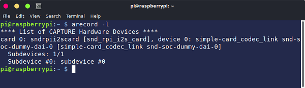

2. `arecord -D plughw:0 -c1 -r 48000 -f S32_LE -t wav -V mono -v file.wav`
- 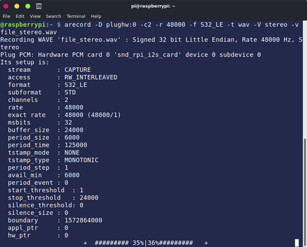

3. `rm file.wav`

4. `python3 ~/edge/source/drivers/micDriver.py`
- 

#### **A2. Motion Processing Unit**

**First**, Open I2C1 interface of CM4.
1. `sudo raspi-config`
2. Select `3 Interface Options` and type *Enter* key.
3. Select `I5 I2C` and type *Enter* key.
4. Select `YES` via *Tab* Key
5. Select `Finish` via *Tab* Key
3. `sudo reboot` and then connect it again via ssh.

**Second**, Check the status of i2c1 and the device mount on it.

1. `i2cdetect -l` to show all i2c interfaces.

- 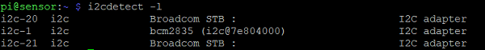

2. `i2cdetect -y 1` the show all device mount on i2c1 interface, the **0x68** is the address of MPU9250.

- 

**Third**, test the driver of MPU9250.

1. `python3 ~/edge/source/drivers/mpuDriver.py`
- 

[Not work for Magnetometer](https://github.com/kriswiner/MPU9250/issues/123)

#### **A3. Laser Distance**
**First**, Open I2C1 interface of CM4.

It has been opened in the above, no need to open it again. If there is no i2c-1, please operate again.

`i2cdetect -l` to show all i2c interfaces.

- 

**Second**, Check the status of i2c1 and the device mount on it.
1. `i2cdetect -y 1` the show all device mount on i2c1 interface, the **0x29** is the address of VL53L1X.

- 

**Third**, test the driver of VL53L1X.

1. `python3 ~/edge/source/drivers/laserDriver.py`

- 

#### **A4. EYE**
**First**, Open I2C1 interface of CM4.

It has been opened in the above, no need to open it again. If there is no i2c-1, please operate again.

1. `i2cdetect -l` to show all i2c interfaces.`
- 

2. `i2cdetect -y 1` the show all device mount on i2c1 interface, the **0x69** is the address of AMG8833.
- 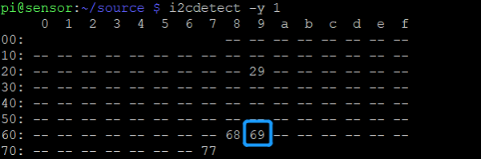

**Second**, test the driver of AMG8833.

1. `python3 ~/edge/source/drivers/eyeDriver.py`
- 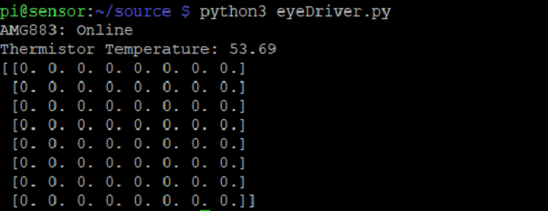

#### **A5. BME**
**First**, Open I2C1 interface of CM4.

It has been opened in the above, no need to open it again. If there is no i2c-1, please operate again.

1. `i2cdetect -l` to show all i2c interfaces.`
- 

2. `i2cdetect -y 1` the show all device mount on i2c1 interface, the **0x77** is the address of BME280.
- 

**Second**, test the driver of BME280.

1. `python3 ~/edge/source/drivers/bmeDriver.py`
- 

#### **A6. Color**

**First**, Open I2C3 interface of CM4.
1. `sudo vim /boot/config.txt`
2. add `dtoverlay=i2c3,pin_4_5=1` below *# uncommet some or all of these to enable the opetional optional hardware interfaces*.
- 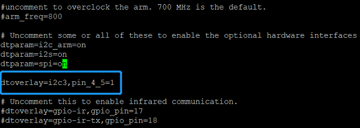
3. save it and execut the command `sudo reboot` to reboot the ECSK.

**Second**, Check the status of i2c3 and the device mount on it.

1. `i2cdetect -l` to show all i2c interfaces.

- 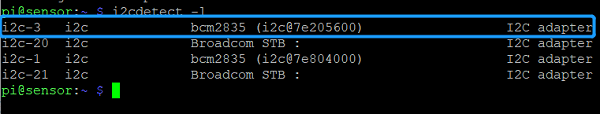

2. `i2cdetect -y 3` the show all device mount on i2c3 interface, the **0x44** is the address of ISL29125.

- 

**Third**, test the driver of ISL29125.

1. `python3 ~/edge/source/drivers/islDriver.py`
- 

#### **A7. ADC**
**First**, Open I2C3 interface of CM4.

It has been opened in the above, no need to open it again. If there is no i2c-3, please operate again.

1. `i2cdetect -l` to show all i2c interfaces.`
- 

2. `i2cdetect -y 3` the show all device mount on i2c1 interface, the **0x48** is the address of ADC.
- 

**Second**, Check the status of i2c3 and the device which mounted on it.

*Actually, we added two sensors AMN21111 and 100H Inductors on ADC, but we did not use them in this version. We will extent them in next version.*

#### **A8. Camera**
**First**, Open CSI1 interface of CM4.

1. `sudo vim /boot/config.txt`
2. add `dtoverlay=imx219,cam1` below *# Automatically load overlays for detected cameras*.
- 
3. save it and execut the command `sudo reboot` to reboot the ECSK.

**Second**, Check the status of CSI1.
1. `i2cdetect -l`
- 

2. `libcamera-hello --list`
- 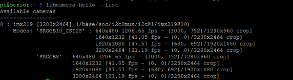

**Third**, make a picture.
1. `libcamera-jpeg -o test.jpg`
- 
- 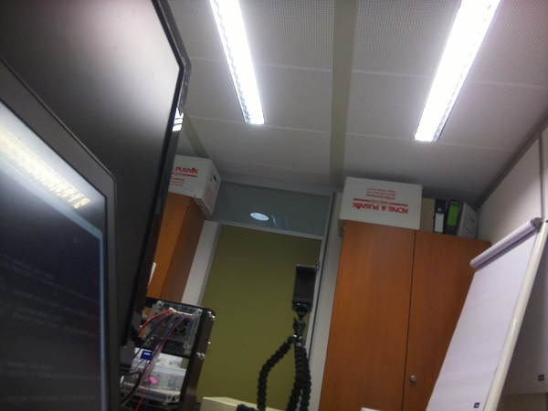

*You can use SFTP software to download the picture from ECCSK, e.g. [FileZilla](https://filezilla-project.org/), the SFTP Port is 22. You can also use other software, e.g. [Pycharm](https://www.jetbrains.com/pycharm/). Here we do not intruduce how to use SFTP, please Google it yourself.*

## **SAMPLING**

In this section, we introduce how to use **ECSK** to sample the raw data for model training. Please ignore this section If you just want to use the sampled raw data or trained models. Because we have already sampled the raw data and trained some models for some scenes, e.g. CNC machine, Office, BOH machine, Logistics Car, so you can use these raw directly to train you model, and then deploy these model on you ECSK.

Here, we strongly recommend [Pycharm](https://www.jetbrains.com/pycharm/download/#section=windows) to develop edge project, and we do not make too much of the use of Pycharm, please Google it yourself.

### **Download source code to PC**
1. Create a empty folder named ECSK on PC in your perferred location. enter the floder and open the **Git Bash Here** by right click, *(make sure that you have already installed the **git**)*.
- 

2. `git clone https://github.com/chubohao/edge-computing-sensor-kit.git ./` please ignore thie step if you have already downloaded it.
- 

3. Use pycharm to open its subfolder *"ecsk/software/edge/"*
- 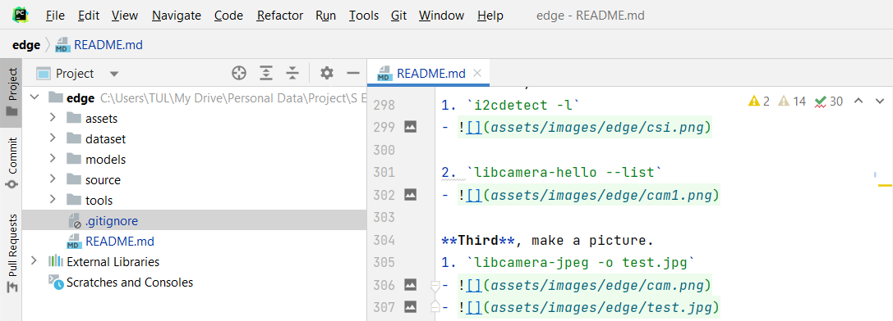

4. Make the configuration for deployment.
- Tools-> Deployment-> Configuration

- 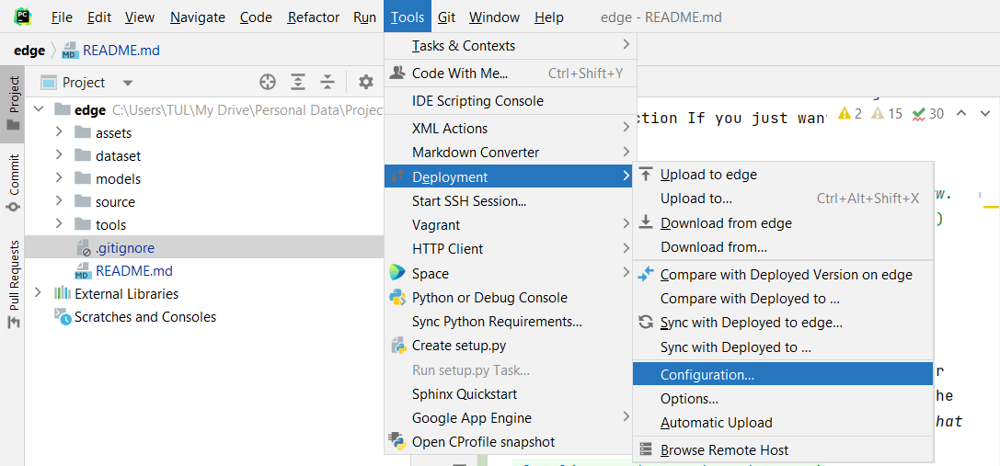
- Click "**+**", and select SFTP, and input the alias, here I inputted "**edge**".
- 
- SSH configuration
- 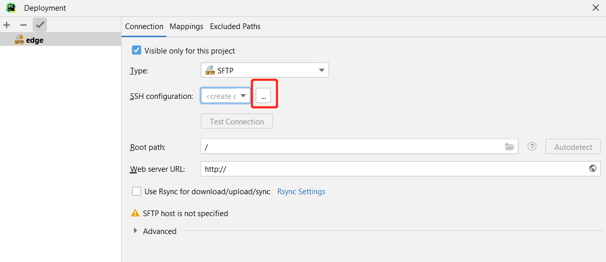
- Input the *host ip*, *username*, and *password* of ECSK, and test connnection.
- 
- In **Connection** page, click **Autodetect**.
- 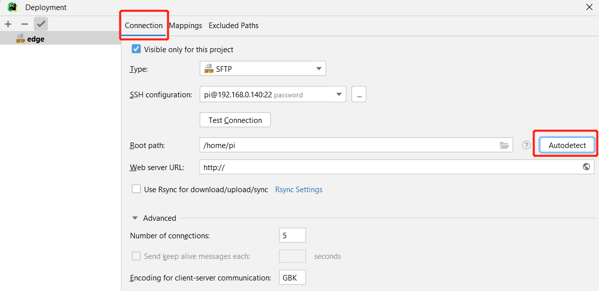
- In **Mappings** page, input */edge* to Deployment path.
- 
- Finally, select **Automatic Upload(Always)**, then your code will automatically upload to ECSK after the code is changed.
- 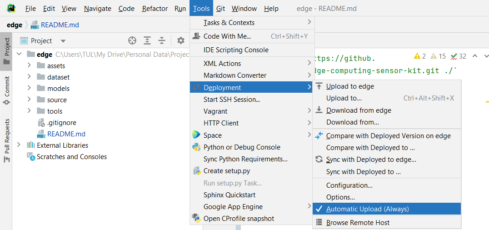
- Open SSH tools of Pycharm/.
- 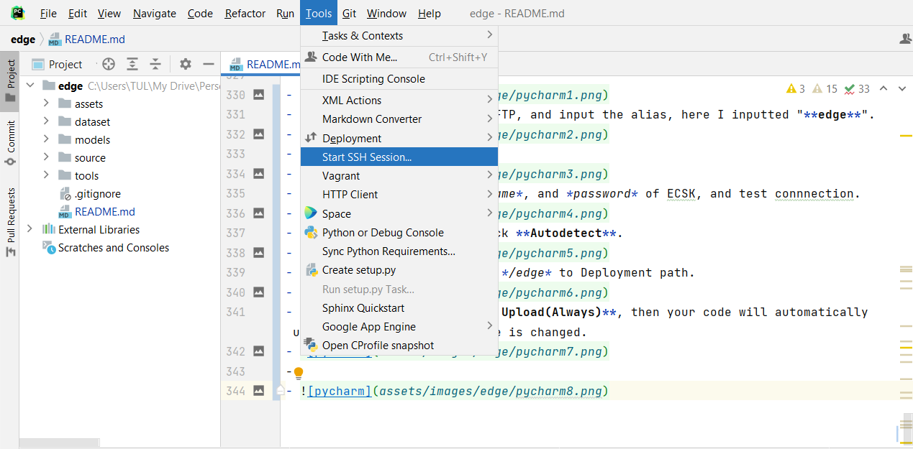
- Then you can use it to control your ECSK instead of PuTTY.
- 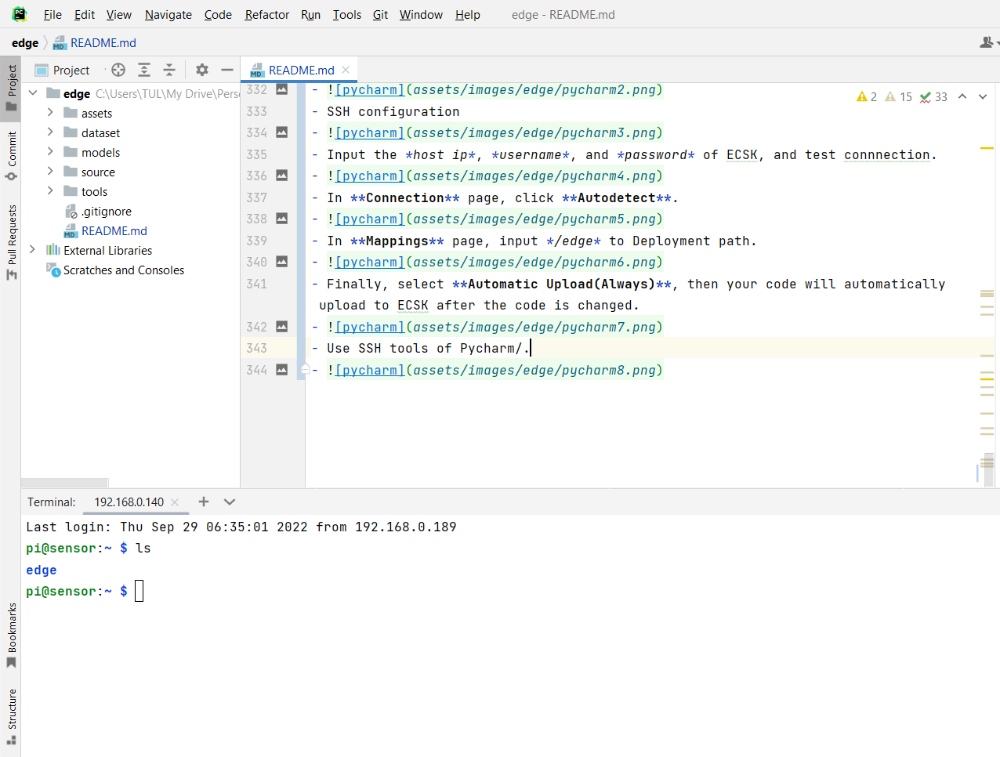

5. Config the scene information in the file of **source/arguments.py**, you should change the variable **dataset**, **activity**, and **duration** according your scenes.
- 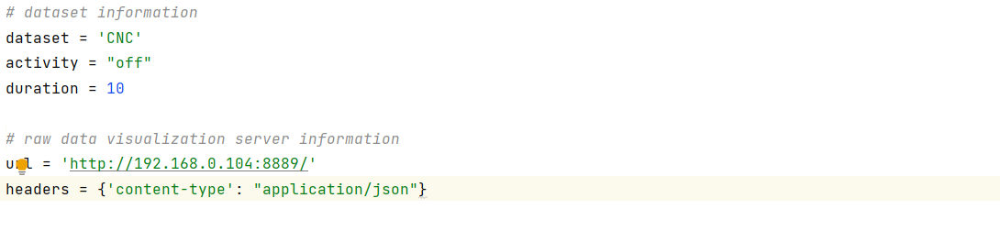

6. Execute the sampling program, please make sure the activity is taking place in your scenario.
- `python3 ~/edge/source/sampling/sampling.py`
- 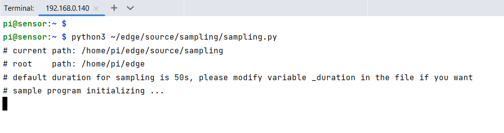

7. Download the data from ECSK for the next training.
- Tools-> Deployment-> Browse Remote Host
- 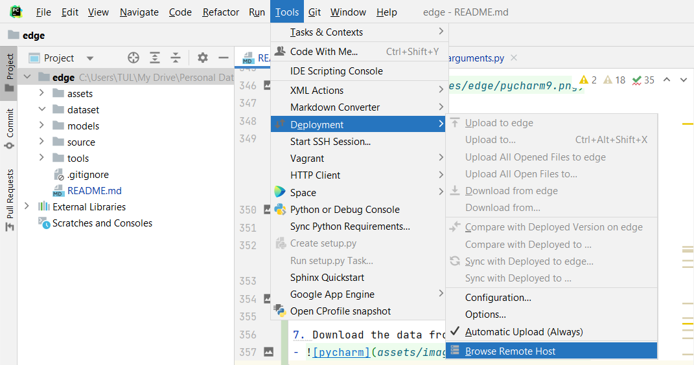
- In the ECSK, select the folder dataset, and downlaod form here.
- 
- Then you can find them in you PC.
- 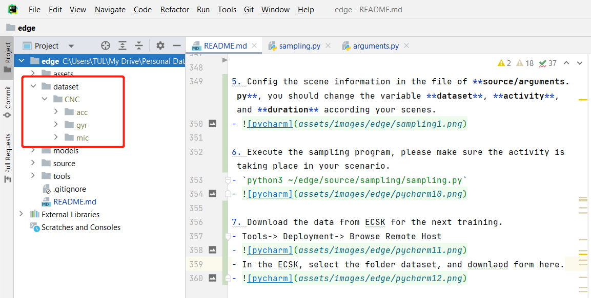

## WARNING
> ALSA lib pcm.c:2660:(snd_pcm_open_noupdate) Unknown PCM cards.pcm.rear
ALSA lib pcm.c:2660:(snd_pcm_open_noupdate) Unknown PCM cards.pcm.center_lfe
ALSA lib pcm.c:2660:(snd_pcm_open_noupdate) Unknown PCM cards.pcm.side
ALSA lib pcm.c:2660:(snd_pcm_open_noupdate) Unknown PCM cards.pcm.surround21
ALSA lib pcm.c:2660:(snd_pcm_open_noupdate) Unknown PCM cards.pcm.surround21
ALSA lib pcm.c:2660:(snd_pcm_open_noupdate) Unknown PCM cards.pcm.surround40
ALSA lib pcm.c:2660:(snd_pcm_open_noupdate) Unknown PCM cards.pcm.surround41
ALSA lib pcm.c:2660:(snd_pcm_open_noupdate) Unknown PCM cards.pcm.surround50
ALSA lib pcm.c:2660:(snd_pcm_open_noupdate) Unknown PCM cards.pcm.surround51
ALSA lib pcm.c:2660:(snd_pcm_open_noupdate) Unknown PCM cards.pcm.surround71
ALSA lib pcm.c:2660:(snd_pcm_open_noupdate) Unknown PCM cards.pcm.iec958
ALSA lib pcm.c:2660:(snd_pcm_open_noupdate) Unknown PCM cards.pcm.iec958
ALSA lib pcm.c:2660:(snd_pcm_open_noupdate) Unknown PCM cards.pcm.iec958
ALSA lib confmisc.c:1281:(snd_func_refer) Unable to find definition 'cards.simple-card.pcm.hdmi.0:CARD=0,AES0=4,AES1=130,AES2=0,AES3=2'
ALSA lib conf.c:4745:(_snd_config_evaluate) function snd_func_refer returned error: No such file or directory
ALSA lib conf.c:5233:(snd_config_expand) Evaluate error: No such file or directory
ALSA lib pcm.c:2660:(snd_pcm_open_noupdate) Unknown PCM hdmi
ALSA lib confmisc.c:1281:(snd_func_refer) Unable to find definition 'cards.simple-card.pcm.hdmi.0:CARD=0,AES0=4,AES1=130,AES2=0,AES3=2'
ALSA lib conf.c:4745:(_snd_config_evaluate) function snd_func_refer returned error: No such file or directory
ALSA lib conf.c:5233:(snd_config_expand) Evaluate error: No such file or directory
ALSA lib pcm.c:2660:(snd_pcm_open_noupdate) Unknown PCM hdmi
ALSA lib pcm.c:2660:(snd_pcm_open_noupdate) Unknown PCM cards.pcm.modem
ALSA lib pcm.c:2660:(snd_pcm_open_noupdate) Unknown PCM cards.pcm.modem
ALSA lib pcm.c:2660:(snd_pcm_open_noupdate) Unknown PCM cards.pcm.phoneline
ALSA lib pcm.c:2660:(snd_pcm_open_noupdate) Unknown PCM cards.pcm.phoneline

`sudo cp ~/edge/tools/alsa.conf /usr/share/alsa/`
